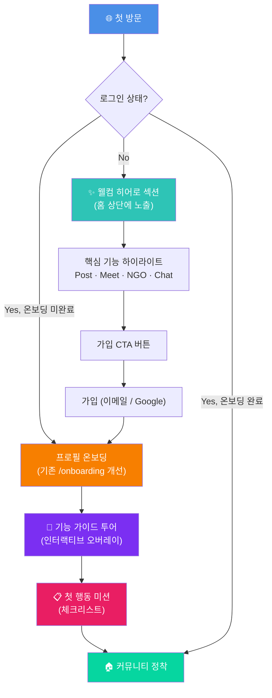
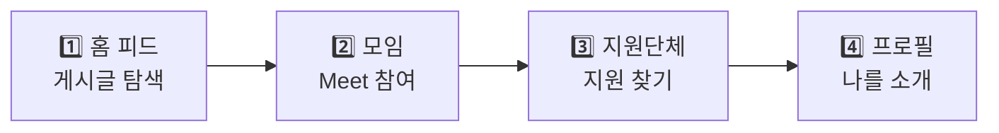
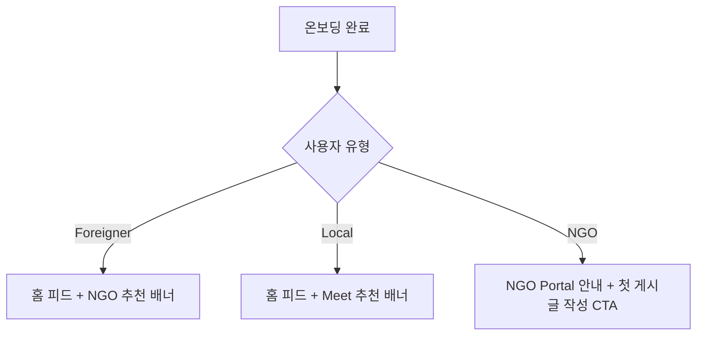

# Borderly 신규 사용자 온보딩 기획서

> **작성일**: 2026-04-06  
> **대상**: borderly-global.com 첫 방문 사용자 (외국인 / 내국인 / NGO 파트너)  
> **목표**: 사이트를 처음 접한 누구나 Borderly의 가치를 빠르게 이해하고, 가입 후 핵심 기능을 자연스럽게 사용하여 커뮤니티에 정착할 수 있도록 안내  
> **분석 기반**: 코드베이스 전체 분석 + 실제 라이브 사이트(borderly-global.com) 페이지별 스크린샷 확인

---

## 목차

1. [현재 상태 분석](#1-현재-상태-분석)
2. [사용자 여정 전체 흐름](#2-사용자-여정-전체-흐름)
3. [Phase 1: 첫인상 — 랜딩/홈 경험](#3-phase-1-첫인상--랜딩홈-경험)
4. [Phase 2: 가입 흐름 최적화](#4-phase-2-가입-흐름-최적화)
5. [Phase 3: 프로필 온보딩 (기존 시스템 개선)](#5-phase-3-프로필-온보딩-기존-시스템-개선)
6. [Phase 4: 기능 가이드 투어](#6-phase-4-기능-가이드-투어)
7. [Phase 5: 정착 유도 — 첫 행동 미션](#7-phase-5-정착-유도--첫-행동-미션)
8. [사용자 유형별 맞춤 전략](#8-사용자-유형별-맞춤-전략)
9. [다국어 & 접근성 전략](#9-다국어--접근성-전략)
10. [리텐션 & 재방문 전략](#10-리텐션--재방문-전략)
11. [측정 지표 (KPI)](#11-측정-지표-kpi)
12. [구현 우선순위 로드맵](#12-구현-우선순위-로드맵)

---

## 1. 현재 상태 분석

### 1.1 실제 라이브 사이트 관찰

> 아래는 실제 borderly-global.com 의 주요 페이지 스크린샷입니다.

````carousel

<!-- slide -->

<!-- slide -->

<!-- slide -->

````

#### 관찰된 UI 구조 — 반응형 이중 네비게이션

> [!IMPORTANT]
> Borderly는 **반응형 레이아웃**으로, 뷰포트 너비에 따라 네비게이션 구조가 완전히 달라집니다.
> - **모바일 (<1280px)**: 하단 `BottomNav` 5탭 (`xl:hidden`)
> - **데스크톱 (≥1280px)**: 우측 `OnlineSidebar` 340px 고정 사이드바 (`hidden xl:flex`)
>
> 온보딩의 모든 UI 안내는 **두 가지 레이아웃을 모두 고려**해야 합니다.

##### 모바일 레이아웃 (<1280px)

| 요소 | 실제 구현 |
|------|----------|
| **상단 헤더** | 🐧 펭귄 로고 + "BORDERLY" 그래디언트 텍스트 + 검색·알림·프로필 아이콘 |
| **하단 네비 (BottomNav)** | 5탭: **Explore**(`/`) · **Home**(`/browse`) · **Meet**(`/meet`) · **Chats**(`/chats`) · **Supporters**(`/ngo`) |
| **검색** | Glass 스타일 검색바 + 우측 `+` 생성 버튼 |
| **필터** | 색상 아이콘이 있는 pill 형태 카테고리 탭 (수평 스크롤) |
| **카드** | Notion 스타일 multi-layer shadow 카드 (b-card) |
| **PWA 배너** | 하단에 "Install Borderly for a better experience" 다크 배너 상시 노출 |
| **디자인 톤** | 밝은 #F8FAFE 배경, #4A8FE7 프라이머리, 따뜻한 파스텔 카테고리 컬러 |

##### 데스크톱 레이아웃 (≥1280px)

| 요소 | 실제 구현 |
|------|----------|
| **상단 헤더** | 동일 (사용자 이름이 프로필 아이콘 옆에 추가 표시) |
| **하단 네비** | ❌ 숨김 (`xl:hidden`) |
| **우측 사이드바 (OnlineSidebar)** | `right-0 top-14 w-[340px]` 고정, 3개 카드로 구성 |
| **사이드바 > Page Info 카드** | 현재 페이지의 제목 + 설명 (컨텍스트 인지) |
| **사이드바 > Friends 카드** | 상호 팔로우 목록 + 온라인 상태 표시 + 검색 |
| **사이드바 > Explore 카드** | 네비게이션 링크: Explore All · Community Feed · Ice Breaking · Chats · Supporters Directory · Settings |
| **메인 콘텐츠** | `xl:mr-[340px]` 로 사이드바 공간 확보 |
| **PWA 배너** | 동일 (하단 전체 너비) |

##### 네비게이션 라벨 매핑 (모바일 vs 데스크톱)

> [!WARNING]
> 동일한 페이지인데 모바일과 데스크톱에서 **라벨이 다릅니다**. 온보딩 가이드에서 라벨 혼란을 방지해야 합니다.

| 경로 | 모바일 BottomNav 라벨 | 데스크톱 Sidebar 라벨 | 비고 |
|------|---------------------|---------------------|------|
| `/` | Explore | Explore All | — |
| `/browse` | **Home** | **Community Feed** | ⚠️ 라벨 완전히 다름 |
| `/meet` | Meet | **Ice Breaking** | ⚠️ 라벨 다름 |
| `/chats` | Chats | Chats | 동일 |
| `/ngo` | Supporters | **Supporters Directory** | 약간 다름 |
| `/settings` | ❌ 없음 (프로필 메뉴 하위) | ✅ 직접 노출 | 데스크톱만 노출 |

### 1.2 현재 사용자 진입 경로

```mermaid
flowchart LR
    A[첫 방문] --> B{로그인 상태?}
    B -->|No| C[Explore = 커뮤니티 피드]
    B -->|Yes| D{온보딩 완료?}
    D -->|No| E[/onboarding 페이지]
    D -->|Yes| C
    C --> F{화면 너비}
    F -->|"<1280px"| G[하단 네비: Explore / Home / Meet / Chats / Supporters]
    F -->|"≥1280px"| H[우측 사이드바: Explore All / Community Feed / Ice Breaking / Chats / Supporters Directory / Settings]
```

### 1.3 현재 온보딩 시스템 구조

현재 `/onboarding` 페이지는 **가입 후 프로필 설정**에 초점이 맞춰져 있으며, 다음 스텝으로 구성됨:

| Step | 내용 | 비고 |
|------|------|------|
| 0 | Google 사용자 웰컴 카드 | Google OAuth 전용 |
| 1 | UI 언어 선택 (EN/KO/JA) | 3개 언어 지원 |
| 2 | 사용자 유형 선택 | Local / Foreigner / NGO Partner |
| 3 | 닉네임 설정 | Google 신규 사용자만 |
| 4 | 구사 언어 선택 | 다중 선택 가능 |
| 5 | 국가 정보 입력 | 거주 국가 + 출신 국가 |
| 6 | 이용 목적 선택 / NGO 정보 입력 | 마지막 스텝 |

### 1.4 현재 시스템의 한계점 (실제 화면 기반)

> [!WARNING]
> **핵심 문제: 비로그인 사용자를 위한 온보딩이 전혀 없음**

| 문제점 | 설명 | 실제 화면 확인 |
|--------|------|---------------|
| ❌ **랜딩 페이지 부재** | 첫 방문자가 바로 커뮤니티 피드를 보게 됨 → "이 사이트가 뭔지" 모름 | ✅ 확인됨 — Explore 탭이 바로 게시글 피드 |
| ❌ **가치 제안 부재** | Borderly가 왜 필요한지, 어떤 문제를 해결하는지 설명 없음 | ✅ 확인됨 — 설명 텍스트 전무 |
| ❌ **기능 가이드 없음** | Meet, Supporters, 번역, DM 등 핵심 기능을 자연스럽게 발견할 경로 없음 | ✅ 확인됨 — 모바일은 하단 탭, 데스크톱은 우측 사이드바에서만 발견 가능 |
| ❌ **첫 행동 유도 없음** | 가입 후 "뭘 해야 하지?" 상태에서 이탈 가능 | ✅ 확인됨 — 프로필에 미션/가이드 없음 |
| ❌ **콘텐츠 부족 시 빈 상태** | Supporters 페이지가 완전히 비어 있음 (0 results) | ✅ 확인됨 — 빈 상태가 참여 유도 안 함 |
| ⚠️ **PWA 배너 항상 노출** | 온보딩 전/후 관계없이 "Install Borderly" 배너가 하단에 상시 표시 | ✅ 확인됨 — 모든 페이지 하단 |
| ⚠️ **Purpose 페이지 중복** | `/onboarding/purpose`와 `/onboarding` 내 purpose 스텝이 분리되어 혼란 | 코드에서 확인 |
| ⚠️ **네비 라벨 불일치** | 모바일/데스크톱 간 동일 페이지의 라벨이 다름 (Home vs Community Feed, Meet vs Ice Breaking 등) | ✅ 확인됨 |

---

## 2. 사용자 여정 전체 흐름

### 2.1 개선된 전체 흐름 (To-Be)



### 2.2 단계별 핵심 목표

| Phase | 이름 | 목표 | 예상 소요 시간 |
|-------|------|------|---------------|
| 1 | 첫인상 | "이게 나한테 필요한 서비스다" 인식 | 10초 |
| 2 | 가입 | 계정 생성 완료 | 1~2분 |
| 3 | 프로필 온보딩 | 프로필 정보 완성 | 1~2분 |
| 4 | 기능 가이드 | 핵심 기능 3개 이상 인지 | 30초 |
| 5 | 첫 행동 | 첫 게시물/모임 참여/프로필 완성 | 첫 주 내 |

---

## 3. Phase 1: 첫인상 — 랜딩/홈 경험

### 3.1 웰컴 히어로 섹션 (비로그인 사용자 전용)

> [!IMPORTANT]
> 홈페이지(`/` = `app/page.tsx`) 상단에 **비로그인 사용자에게만** 웰컴 히어로 섹션을 표시합니다.  
> 로그인 후에는 기존 커뮤니티 피드가 그대로 노출됩니다.

#### 히어로 섹션 구성

> [!TIP]
> 현재 Explore 탭에 로그인하면 바로 검색바 → Posts/Meets 탭 → 카테고리 필터 → 게시글 카드가 보입니다.  
> 비로그인 사용자에게는 이 검색바 **위**에 웰컴 히어로 블록을 삽입합니다.

```
┌─────────────────────────────────────────────┐
│  🐧                                         │
│   BORDERLY                                  │
│                                             │
│   국경을 넘어, 사람을 연결합니다              │
│   Connect across borders                    │
│                                             │
│   외국인, 난민, 현지인 모두가 함께하는        │
│   커뮤니티 플랫폼                            │
│                                             │
│   [시작하기]  [둘러보기]                      │
│                                             │
│   ── 30초만에 가입 · 3개 언어 지원 ──        │
│                                             │
├─────────────────────────────────────────────┤
│  (기존 검색바 + Posts/Meets 탭 + 피드 시작)  │
└─────────────────────────────────────────────┘
```

#### 핵심 메시지 (다국어)

| 언어 | 메인 카피 | 서브 카피 |
|------|----------|----------|
| 🇺🇸 EN | "Connect Across Borders" | "A community where foreigners, refugees, and locals come together" |
| 🇰🇷 KO | "국경을 넘어, 사람을 연결합니다" | "외국인, 난민, 현지인 모두가 함께하는 커뮤니티" |
| 🇯🇵 JA | "国境を超えて、人と繋がる" | "外国人・難民・地元の人が集まるコミュニティ" |

#### 디자인 가이드라인

- **배경**: `var(--bg-snow)` 위에 subtle gradient (`primary → accent` 방향)
- **애니메이션**: `b-animate-in` 클래스로 fade-up 효과
- **CTA 버튼**: `b-btn-primary` 스타일 ("시작하기" → `/signup`)
- **보조 버튼**: `b-btn-secondary` 스타일 ("둘러보기" → 피드로 스크롤)
- **닫기**: `localStorage`에 `borderly_hero_dismissed` 저장하여 한번 닫으면 재노출 안 함

### 3.2 기능 하이라이트 카드

히어로 섹션 아래에 4개의 핵심 기능 카드를 표시:

```
┌──────────┐ ┌──────────┐ ┌──────────┐ ┌──────────┐
│ 📝 Posts │ │ 🤝 Meet  │ │ 🏢 NGO   │ │ 💬 Chat  │
│          │ │          │ │          │ │          │
│ 커뮤니티  │ │ 오프라인  │ │ 지원 단체 │ │ 실시간   │
│ 게시판   │ │ 모임     │ │ 디렉토리 │ │ 메시지   │
│          │ │          │ │          │ │          │
│ 정보·질문 │ │ 행아웃   │ │ 취업·법률 │ │ DM·그룹  │
│ 일상·구인 │ │ 스터디   │ │ 교육·건강 │ │ 번역기능 │
└──────────┘ └──────────┘ └──────────┘ └──────────┘
```

| 카드 | 아이콘 | 실제 네비 라벨 | 제목 | 설명 | 링크 |
|------|--------|-------------|------|------|------|
| Posts | `FileText` | Explore | 커뮤니티 피드 | 정보(Info), 질문(Question), 일상(Daily), 구인(Jobs) 카테고리별 게시글 공유 | `/` |
| Meet | `CalendarDays` | Meet | 오프라인 모임 | Hangout, Study, Language, Meal, Sports 5종 모임 + 커버 이미지 | `/meet` |
| Supporters | `Building2` | Supporters | 지원 단체 찾기 | Jobs, Housing, Legal, Education, Health 분야별 단체 연결 + Apply as Partner | `/ngo` |
| Chat | `MessageCircle` | Chats | 실시간 채팅 | DM & 그룹 채팅, 인앱 번역, 읽음 확인 | `/chats` |

### 3.3 소셜 프루프 섹션 (선택)

> 커뮤니티 활동 통계를 간단히 표시

```
[🌍 15개국 사용자]  [📝 200+ 게시글]  [🤝 50+ 모임]
```

- DB에서 실시간 카운트를 가져오거나, 초기에는 정적 수치로 시작

---

## 4. Phase 2: 가입 흐름 최적화

### 4.1 현재 가입 흐름 분석

현재 2가지 가입 방법 존재:
1. **Google OAuth** → `/onboarding`으로 리디렉트
2. **이메일 가입** → 이메일 인증 → 로그인 → `/onboarding`

### 4.2 개선 제안

#### A. 가입 페이지 개선 (`/signup`)

| 항목 | 현재 | 개선 |
|------|------|------|
| 가입 이유 설명 | ❌ 없음 | ✅ "가입하면 할 수 있는 것" 3줄 요약 추가 |
| 진행 표시 | ❌ 없음 | ✅ "Step 1/2" 프로그레스 바 (가입 → 프로필 설정) |
| 소셜 프루프 | ❌ 없음 | ✅ "1,000+명이 함께하고 있어요" 문구 |
| NGO 안내 | ⚠️ 간략 | ✅ NGO 선택 시 별도 안내 카드 강화 |

#### B. 이메일 인증 후 흐름 개선

```mermaid
flowchart LR
    A[이메일 인증 완료] --> B[자동 로그인]
    B --> C[/onboarding 리디렉트]
    C --> D[프로필 온보딩 시작]
```

> [!TIP]
> 현재 이메일 인증 후 `/signup/verify-email`에서 대기 → 수동 로그인 → 홈으로 이동하는데, 인증 완료 시 자동으로 `/onboarding`으로 보내는 것이 좋습니다.

#### C. Google OAuth 흐름 (현재 양호)

```
Google 로그인 → /onboarding → 웰컴 카드 (Step 0) → 프로필 설정
```

이 흐름은 현재 잘 구현되어 있으므로 유지합니다.

---

## 5. Phase 3: 프로필 온보딩 (기존 시스템 개선)

### 5.1 현재 `/onboarding` 개선 사항

#### A. 시각적 친근함 강화

| 스텝 | 현재 | 개선 |
|------|------|------|
| UI 언어 선택 | 텍스트 버튼 | 🏳️ 국기 이모지 + 네이티브 언어명 강조 |
| 사용자 유형 | 아이콘 + 텍스트 | 각 유형별 짧은 설명 추가 |
| 언어 선택 | 검색 드롭다운 | 인기 언어 5개 먼저 보여주기 |
| 국가 선택 | 검색 드롭다운 | 인기 국가 5개 먼저 보여주기 |

#### B. 각 스텝별 맥락 설명 추가

```
Step 1 (UI 언어):
  "앱의 모든 메뉴와 안내가 선택한 언어로 표시됩니다."
  "설정에서 언제든 변경할 수 있어요."

Step 2 (사용자 유형):
  Foreigner: "외국인/이주민으로서 커뮤니티에 참여합니다"
  Local: "현지인으로서 외국인 친구를 만들고 도움을 줍니다"
  NGO: "단체/기관으로서 서비스를 알리고 커뮤니티를 지원합니다"

Step 4 (구사 언어):
  "다른 사용자가 당신과 소통할 수 있는 언어를 알 수 있어요."
  "프로필에 표시되며, 모임 매칭에도 활용됩니다."

Step 5 (국가 정보):
  "같은 나라 출신 사용자를 찾거나, 현지 정보를 공유할 때 활용됩니다."

Step 6 (이용 목적):
  "관심사에 맞는 콘텐츠와 모임을 추천해 드립니다."
```

#### C. 온보딩 완료 축하 화면

현재 온보딩 완료 시 바로 `/`로 리디렉트되는데, 중간에 축하 화면을 추가:

```
┌─────────────────────────────────┐
│                                 │
│         🎉                      │
│                                 │
│   프로필 설정이 완료되었어요!     │
│   Welcome to Borderly!          │
│                                 │
│   ┌─ 이제 이것들을 해보세요 ─┐   │
│   │ □ 첫 게시글 작성하기     │   │
│   │ □ 모임 참여하기          │   │
│   │ □ 프로필 사진 설정하기   │   │
│   └─────────────────────────┘   │
│                                 │
│   [커뮤니티 둘러보기 →]          │
│                                 │
└─────────────────────────────────┘
```

### 5.2 `/onboarding/purpose` 정리

> [!WARNING]
> 현재 `/onboarding` 내 purpose 스텝과 `/onboarding/purpose` 페이지가 중복됩니다.

**제안**: `/onboarding/purpose`는 **레거시로 분류**하고, 메인 `/onboarding` 플로우의 마지막 스텝(purpose 선택)으로 통합합니다. 기존 purpose 페이지는 미완성 사용자를 위한 fallback으로만 유지합니다.

---

## 6. Phase 4: 기능 가이드 투어

### 6.1 인터랙티브 가이드 투어 (온보딩 완료 직후)

온보딩 완료 후 홈에 도착했을 때, **4단계 오버레이 가이드**를 표시합니다.

> [!IMPORTANT]
> 가이드 투어는 **현재 뷰포트 너비에 따라 하이라이트 대상이 달라져야** 합니다.
> - 모바일: 하단 `BottomNav`의 탭 아이콘을 하이라이트
> - 데스크톱: 우측 `OnlineSidebar`의 Explore 카드 내 네비 링크를 하이라이트



#### 각 스텝 상세 — 모바일 (<1280px)

| 순서 | 하이라이트 영역 | 탭 라벨 | 말풍선 위치 | 말풍선 내용 | CTA |
|------|----------------|--------|-----------|------------|-----|
| 1/4 | 검색바 + 카테고리 필터 | — | 하단에 표시 | "커뮤니티 피드에서 정보, 질문, 일상을 나눠보세요. 카테고리 pill로 필터링! 우측 `+` 버튼으로 새 글 작성!" | "다음" |
| 2/4 | **하단 네비** Meet 탭 아이콘 | Meet | 탭 **위**에 표시 | "오프라인 모임에 참여해보세요! Hangout, Study, Language, Meal, Sports 중 관심있는 모임을 선택하세요." | "다음" |
| 3/4 | **하단 네비** Supporters 탭 아이콘 | Supporters | 탭 **위**에 표시 | "도움이 필요하신가요? Jobs, Housing, Legal, Education, Health 분야별 지원 단체를 찾아보세요." | "다음" |
| 4/4 | **상단 헤더** 프로필 아이콘 | — | 아이콘 **아래**에 표시 | "프로필을 꾸미고, QR 공유, 다른 사용자를 팔로우하고, 채팅을 시작해보세요!" | "시작하기!" |

#### 각 스텝 상세 — 데스크톱 (≥1280px)

| 순서 | 하이라이트 영역 | 사이드바 라벨 | 말풍선 위치 | 말풍선 내용 | CTA |
|------|----------------|------------|-----------|------------|-----|
| 1/4 | 검색바 + 카테고리 필터 | — | 하단에 표시 | "커뮤니티 피드에서 정보, 질문, 일상을 나눠보세요. 카테고리 pill로 필터링! 우측 `+` 버튼으로 새 글 작성!" | "다음" |
| 2/4 | **우측 사이드바** "Ice Breaking" 링크 | Ice Breaking | 링크 **왼쪽**에 표시 | "오프라인 모임에 참여해보세요! Hangout, Study, Language, Meal, Sports 중 관심있는 모임을 선택하세요." | "다음" |
| 3/4 | **우측 사이드바** "Supporters Directory" 링크 | Supporters Directory | 링크 **왼쪽**에 표시 | "도움이 필요하신가요? Jobs, Housing, Legal, Education, Health 분야별 지원 단체를 찾아보세요." | "다음" |
| 4/4 | **우측 사이드바** Friends 카드 + **상단 헤더** 프로필 | — | 카드 **왼쪽**에 표시 | "프로필을 꾸미고, 친구 목록을 확인하고, 온라인 친구와 바로 채팅을 시작해보세요!" | "시작하기!" |

> [!TIP]
> 데스크톱에서는 사이드바의 **Friends 카드**와 **Page Info 카드**도 가이드 대상으로 활용할 수 있습니다.
> Friends 카드는 모바일에 없는 데스크톱 전용 기능이므로, 4/4 스텝에서 추가 언급합니다.

#### 구현 방식

- **컴포넌트**: `app/components/GuideTour.tsx` (새로 생성)
- **반응형 감지**: `window.matchMedia('(min-width: 1280px)')` 또는 `useMediaQuery` 훅으로 분기
- **하이라이트 대상 선택**:
  - 모바일: `document.querySelector('nav.xl\\:hidden [href="/meet"]')` 등 BottomNav 내 요소
  - 데스크톱: `document.querySelector('aside [href="/meet"]')` 등 OnlineSidebar 내 요소
- **리사이즈 대응**: 가이드 진행 중 화면 크기가 변경되면 현재 스텝의 하이라이트 위치를 재계산
- **상태 관리**: `localStorage`에 `borderly_guide_completed` 저장
- **트리거**: `AuthProvider`에서 `onboarding_completed && !guide_completed` 조건 확인
- **스타일**: 배경 어둡게 + 하이라이트 영역 밝게 + 말풍선 (b-card-glass 스타일)
- **건너뛰기**: 각 스텝에 "건너뛰기" 옵션 제공

### 6.2 데스크톱 전용 추가 가이드 (선택)

데스크톱(≥1280px) 사용자에게는 기본 4스텝 가이드 이후 **사이드바 전용 기능**을 추가로 안내할 수 있습니다:

| 보너스 스텝 | 하이라이트 | 내용 |
|------------|----------|------|
| +1 | Friends 카드 | "상호 팔로우한 친구들의 온라인 상태를 실시간으로 확인하고, 클릭하면 바로 채팅할 수 있어요!" |
| +2 | Page Info 카드 | "현재 보고 있는 페이지의 설명이 여기에 표시돼요. 각 페이지의 기능을 빠르게 파악할 수 있어요!" |
| +3 | Settings 링크 | "언어 변경, 알림 설정, 계정 관리는 여기서! 모바일에서는 프로필 메뉴에서 접근할 수 있어요." |

### 6.3 인앱 번역 기능 안내 (컨텍스트 기반)

사용자가 **외국어 게시글을 처음 만났을 때** 번역 버튼 옆에 툴팁을 표시:

```
💡 "이 게시글을 당신의 언어로 번역할 수 있어요!"
   [번역] 버튼을 눌러보세요.
```

### 6.4 PWA 설치 안내 타이밍

> [!TIP]
> 현재 PWA 설치 프롬프트(`PWAInstall` 컴포넌트)가 있으나, 온보딩과 연계되지 않음

**제안**: 기능 가이드 투어 완료 직후에 PWA 설치를 안내합니다:

```
📱 "Borderly를 홈 화면에 추가하면 앱처럼 사용할 수 있어요!"
   [홈 화면에 추가]  [나중에]
```

---

## 7. Phase 5: 정착 유도 — 첫 행동 미션

### 7.1 신규 사용자 체크리스트

프로필 페이지 상단에 **완료율 프로그레스 바와 미션 체크리스트**를 표시합니다:

```
┌─────────────────────────────────────────┐
│  🚀 Borderly 시작하기          70%     │
│  ████████████████░░░░░░░░              │
│                                         │
│  ✅ 프로필 설정 완료                     │
│  ✅ 첫 번째 게시글 읽기                  │
│  ☐  프로필 사진 설정하기                 │
│  ☐  첫 번째 게시글 작성하기              │
│  ☐  모임 1개 참여하기                   │
│  ✅ 다른 사용자 1명 팔로우하기            │
│  ☐  첫 번째 댓글 남기기                 │
│                                         │
│  [미션 전체 보기]                        │
└─────────────────────────────────────────┘
```

### 7.2 미션 목록 상세

| # | 미션 | 트리거 조건 | 보상/피드백 |
|---|------|-----------|------------|
| 1 | 프로필 설정 완료 | 온보딩 완료 시 | 🎉 축하 애니메이션 |
| 2 | 첫 게시글 읽기 | 게시글 상세 페이지 1회 방문 | ✅ 체크 표시 |
| 3 | 프로필 사진 설정 | avatar_url 업로드 | 프로필 완성도 +15% |
| 4 | 첫 게시글 작성 | posts 테이블에 첫 insert | 🎉 "첫 게시글 작성!" 토스트 |
| 5 | 모임 1개 참여 | meet_participants에 첫 insert | 🎉 "첫 모임 참여!" 토스트 |
| 6 | 사용자 1명 팔로우 | follows 테이블에 첫 insert | ✅ 체크 표시 |
| 7 | 첫 댓글 남기기 | comments 테이블에 첫 insert | ✅ 체크 표시 |

### 7.3 구현 방식

- **저장**: `profiles` 테이블에 `onboarding_missions` JSONB 컬럼 추가
- **체크 로직**: 각 페이지에서 해당 액션 수행 시 미션 완료 처리
- **UI**: 프로필 페이지 `app/profile/page.tsx` 상단에 조건부 렌더링
- **만료**: 모든 미션 완료 시 or 가입 후 2주 경과 시 자동 숨김

---

## 8. 사용자 유형별 맞춤 전략

### 8.1 외국인 (Foreigner) 사용자

> **핵심 니즈**: 정보 접근, 커뮤니티 연결, 생활 지원

| 단계 | 맞춤 안내 |
|------|----------|
| 웰컴 | "새로운 나라에서의 생활, Borderly가 도와드립니다" |
| 온보딩 | 출신 국가/언어 강조, "같은 나라 사람 찾기" 언급 |
| 첫 행동 유도 | NGO 디렉토리 먼저 안내 → "법률/취업/교육 지원 찾기" |
| 콘텐츠 추천 | `info`, `question`, `jobs` 카테고리 우선 노출 |
| 번역 강조 | 게시글/메시지 번역 기능 강조 안내 |
| 모임 추천 | `language`, `meal`, `hangout` 타입 우선 노출 |

### 8.2 내국인 (Local) 사용자

> **핵심 니즈**: 국제적 교류, 외국인 친구 만들기, 봉사

| 단계 | 맞춤 안내 |
|------|----------|
| 웰컴 | "외국인 친구를 만들고, 따뜻한 도움을 나눠보세요" |
| 온보딩 | "현지인으로서 커뮤니티를 더 풍요롭게 만들어주세요" |
| 첫 행동 유도 | Meet 페이지 먼저 안내 → "국제 모임 참여하기" |
| 콘텐츠 추천 | `daily`, `general` 카테고리 + 모든 Meet 타입 |
| 특별 기능 | "외국인 친구에게 정보 공유하기" CTA |
| 모임 추천 | `language`, `study`, `skill` 타입 우선 노출 |

### 8.3 NGO 파트너

> **핵심 니즈**: 조직 홍보, 서비스 공유, 지원 대상 연결

| 단계 | 맞춤 안내 |
|------|----------|
| 웰컴 | "Borderly에서 더 많은 사람에게 지원을 전할 수 있습니다" |
| 온보딩 | 단체 정보 입력 → 인증 대기 안내 강화 |
| 인증 대기 | `/onboarding/ngo/pending` 페이지에 "인증 소요 시간", "그동안 할 수 있는 것" 안내 |
| 인증 완료 후 | NGO Portal 사용법 가이드 → 첫 게시글 작성 독려 |
| 지속 활용 | "지원 대상자가 이 게시글을 보고 신청합니다" 맥락 설명 |

### 8.4 사용자 유형별 첫 화면 차이



---

## 9. 다국어 & 접근성 전략

### 9.1 현재 다국어 지원 현황

- **지원 언어**: English (EN), 한국어 (KO), 日本語 (JA)
- **번역 시스템**: `lib/i18n.ts` 기반 클라이언트 번역 + MyMemory API 인앱 번역
- **언어 전환**: `LangSwitcher` 컴포넌트 (로그인/가입 페이지에 표시)
- **온보딩 첫 스텝**: UI 언어 선택

### 9.2 온보딩 다국어 개선

| 항목 | 개선 내용 |
|------|----------|
| 웰컴 히어로 | 3개 언어 모두 동시 표시 (메인 1개 + 서브 2개) |
| 언어 자동 감지 | `navigator.language`로 브라우저 언어 감지 → 기본 언어 자동 설정 |
| 가입 페이지 | `LangSwitcher` 위치를 더 눈에 띄게 |
| 기능 가이드 투어 | 선택한 UI 언어로 자동 표시 |
| 에러 메시지 | 모든 에러 메시지 다국어 대응 확인 |

### 9.3 `i18n.ts`에 추가해야 할 키

```typescript
// 웰컴 히어로 섹션
"hero.title": "Connect Across Borders",
"hero.subtitle": "A community where foreigners, refugees, and locals come together",
"hero.cta": "Get Started",
"hero.browse": "Browse Community",
"hero.stats.countries": "countries",
"hero.stats.posts": "posts shared",
"hero.stats.meets": "meets organized",

// 기능 가이드 투어
"guide.step1.title": "Community Feed",
"guide.step1.desc": "Share information, ask questions, and connect with others",
"guide.step2.title": "Meet People",
"guide.step2.desc": "Join offline meetups — hangouts, study groups, language exchange, and more",
"guide.step3.title": "Find Support",
"guide.step3.desc": "Discover NGOs and organizations that can help with jobs, housing, legal, and more",
"guide.step4.title": "Your Profile",
"guide.step4.desc": "Set up your profile, follow others, and start chatting",
"guide.skip": "Skip Tour",
"guide.next": "Next",
"guide.finish": "Let's Go!",

// 첫 행동 미션
"missions.title": "Getting Started",
"missions.profileComplete": "Complete your profile",
"missions.readPost": "Read your first post",
"missions.setAvatar": "Set a profile photo",
"missions.writePost": "Write your first post",
"missions.joinMeet": "Join a meetup",
"missions.followUser": "Follow someone",
"missions.writeComment": "Leave your first comment",
"missions.viewAll": "View all missions",

// 온보딩 완료
"onboarding.congrats": "You're all set!",
"onboarding.congratsDesc": "Your profile is ready. Here's what you can do next:",
"onboarding.exploreCommunity": "Explore Community",
```

### 9.4 반응형 온보딩 UI 전략

> [!IMPORTANT]
> 온보딩 관련 모든 UI 컴포넌트는 **모바일/데스크톱 양쪽 레이아웃을 명시적으로 고려**해야 합니다.

#### A. 컴포넌트별 반응형 전략

| 온보딩 요소 | 모바일 (<1280px) | 데스크톱 (≥1280px) |
|------------|-----------------|-------------------|
| **웰컴 히어로** | 전체 너비, 검색바 위에 삽입 | 메인 콘텐츠 영역 내 (사이드바 제외), 더 넓은 레이아웃 활용 |
| **기능 하이라이트 카드** | 2×2 그리드 or 수평 스크롤 | 4열 그리드 |
| **가이드 투어 오버레이** | BottomNav 탭 하이라이트 | OnlineSidebar Explore 링크 하이라이트 |
| **미션 체크리스트** | 프로필 페이지 상단 전체 너비 | 프로필 페이지 상단 (사이드바와 공존) |
| **축하 화면** | 전체 화면 모달 | 중앙 모달 (사이드바 위에 오버레이) |
| **PWA 설치 안내** | 기존 하단 배너 유지 | 사이드바 하단 or 모달 |

#### B. 가이드 투어 말풍선 위치 규칙

```
모바일:
  - 하단 네비 탭 → 말풍선은 탭 위(top)에 표시
  - 상단 헤더 아이콘 → 말풍선은 아이콘 아래(bottom)에 표시
  - 콘텐츠 영역 → 말풍선은 요소 아래(bottom)에 표시

데스크톱:
  - 우측 사이드바 링크 → 말풍선은 링크 왼쪽(left)에 표시
  - 상단 헤더 아이콘 → 말풍선은 아이콘 아래(bottom)에 표시
  - 콘텐츠 영역 → 말풍선은 요소 아래(bottom)에 표시
```

#### C. 네비게이션 라벨 통일 전략

가이드 투어에서 탭/링크를 언급할 때, **현재 뷰포트에 맞는 라벨**을 사용해야 합니다:

```typescript
// GuideTour.tsx 내 라벨 분기 예시
const isDesktop = useMediaQuery('(min-width: 1280px)');

const labels = {
  meet: isDesktop ? t('sidebar.iceBreaking') : t('nav.meet'),
  ngo: isDesktop ? t('sidebar.ngoDirectory') : t('nav.ngo'),
  home: isDesktop ? t('sidebar.communityFeed') : t('nav.home'),
};
```

### 9.5 접근성 고려사항

- 모든 CTA 버튼에 `aria-label` 추가
- 가이드 투어 오버레이에 `role="dialog"` + `aria-modal="true"`
- 프로그레스 바에 `aria-valuenow`, `aria-valuemin`, `aria-valuemax`
- 키보드 네비게이션 지원 (Tab, Enter, Escape)
- 색 대비 비율 WCAG AA 기준 충족 확인

---

## 10. 리텐션 & 재방문 전략

### 10.1 가입 후 첫 7일 커뮤니케이션

| 타이밍 | 채널 | 내용 |
|--------|------|------|
| D+0 | 인앱 | 온보딩 완료 축하 + 미션 체크리스트 |
| D+1 | 알림 | "첫 게시글 아직 안 쓰셨나요? 커뮤니티가 기다리고 있어요!" |
| D+3 | 알림 | "이번 주 인기 모임을 확인해보세요" (Meet 추천) |
| D+5 | 알림 | "OOO님이 팔로우했습니다" (소셜 연결) |
| D+7 | 인앱 | PWA 설치 재안내 (미설치 시) |

### 10.2 비활성 사용자 재참여

| 트리거 | 액션 |
|--------|------|
| 3일간 미접속 | 신규 모임/인기 게시글 알림 |
| 7일간 미접속 | "커뮤니티 새 소식" 이메일 (opt-in) |
| 프로필 미완성 | 프로필 완성 유도 인앱 배너 |
| 게시글 0개 | "첫 글 작성" 부드러운 CTA |

### 10.3 커뮤니티 성장을 활용한 온보딩

- **추천 사용자**: 온보딩 완료 후 "추천 팔로우" 목록 제공 (같은 국가/언어 사용자)
- **인기 콘텐츠**: 첫 피드에 인기 게시글/모임 상위 노출
- **환영 게시글**: 커뮤니티에 자동 생성되는 "환영합니다!" 타입 게시글 or 새 사용자 소개

---

## 11. 측정 지표 (KPI)

### 11.1 퍼널 전환율

| 단계 | 지표 | 목표 |
|------|------|------|
| 방문 → 가입 | 가입 전환율 | > 15% |
| 가입 → 온보딩 완료 | 온보딩 완료율 | > 80% |
| 온보딩 → 첫 행동 (7일 내) | 활성화율 | > 60% |
| 7일 리텐션 | D7 재방문율 | > 40% |
| 30일 리텐션 | D30 재방문율 | > 25% |

### 11.2 온보딩 스텝별 이탈률

| 스텝 | 추적 이벤트 |
|------|------------|
| 웰컴 히어로 노출 | `hero_viewed` |
| 가입 CTA 클릭 | `hero_cta_clicked` |
| 온보딩 Step N 도달 | `onboarding_step_{n}` |
| 온보딩 완료 | `onboarding_completed` |
| 가이드 투어 완료 | `guide_tour_completed` |
| 가이드 투어 건너뛰기 | `guide_tour_skipped` |
| 미션 N 완료 | `mission_{name}_completed` |

### 11.3 핵심 행동 지표

| 행동 | 지표 |
|------|------|
| 첫 게시글 작성까지 평균 시간 | `time_to_first_post` |
| 첫 모임 참여까지 평균 시간 | `time_to_first_meet` |
| 첫 DM 발송까지 평균 시간 | `time_to_first_dm` |
| 프로필 완성도 (가입 7일 후) | `profile_completeness_d7` |

---

## 12. 구현 우선순위 로드맵

### Phase A: 즉시 (1주 이내) — Quick Win

| 우선순위 | 작업 | 난이도 | 영향도 |
|---------|------|--------|--------|
| 🔴 P0 | 홈페이지 웰컴 히어로 섹션 추가 (비로그인) | 중 | 🔥 높음 |
| 🔴 P0 | 온보딩 완료 후 축하 화면 추가 | 낮음 | 중 |
| 🟡 P1 | 온보딩 각 스텝 맥락 설명 텍스트 추가 | 낮음 | 중 |
| 🟡 P1 | i18n 키 추가 (히어로, 가이드, 미션) | 낮음 | 중 |

### Phase B: 단기 (2~3주) — 핵심 기능

| 우선순위 | 작업 | 난이도 | 영향도 |
|---------|------|--------|--------|
| 🔴 P0 | 기능 가이드 투어 컴포넌트 구현 | 중 | 🔥 높음 |
| 🟡 P1 | 사용자 유형별 첫 화면 맞춤 배너 | 중 | 높음 |
| 🟡 P1 | 브라우저 언어 자동 감지 | 낮음 | 중 |
| 🟢 P2 | 기능 하이라이트 카드 (홈 히어로 하단) | 중 | 중 |

### Phase C: 중기 (1~2달) — 정착 시스템

| 우선순위 | 작업 | 난이도 | 영향도 |
|---------|------|--------|--------|
| 🟡 P1 | 신규 사용자 미션 체크리스트 시스템 | 높음 | 🔥 높음 |
| 🟡 P1 | 추천 팔로우 목록 (같은 국가/언어) | 중 | 높음 |
| 🟢 P2 | D+1 ~ D+7 알림 자동화 | 중 | 중 |
| 🟢 P2 | 소셜 프루프 섹션 (실시간 통계) | 낮음 | 낮음 |
| 🟢 P2 | PWA 설치 안내 타이밍 최적화 | 낮음 | 낮음 |

### Phase D: 장기 — 데이터 기반 최적화

| 우선순위 | 작업 | 난이도 | 영향도 |
|---------|------|--------|--------|
| 🟢 P2 | 온보딩 퍼널 분석 대시보드 | 높음 | 중 |
| 🟢 P2 | A/B 테스트 인프라 (히어로 카피, CTA 등) | 높음 | 중 |
| 🟢 P2 | 이메일 리텐션 캠페인 | 중 | 중 |

---

## 부록: 반응형 레이아웃 참고 스크린샷

> 아래는 실제 borderly-global.com의 모바일/데스크톱 레이아웃 비교입니다.

````carousel

<!-- slide -->

````

---

> [!NOTE]
> 이 기획서는 현재 Borderly 코드베이스 (`app/page.tsx`, `app/onboarding/`, `app/signup/`, `app/login/`, `app/meet/`, `app/ngo/`, `app/components/BottomNav.tsx`, `app/components/OnlineSidebar.tsx`, `app/components/AuthLayout.tsx`, `lib/i18n.ts`, `globals.css` 등)의 실제 구현을 기반으로 작성되었습니다. 기존 디자인 시스템(b-card, b-pill, b-btn-primary 등)과 기술 스택(Next.js 16, Supabase, Tailwind CSS 4)을 최대한 활용하는 방향으로 설계되었습니다.
>
> **반응형 브레이크포인트**: `xl` (1280px) 기준으로 BottomNav ↔ OnlineSidebar 전환. `AuthLayout.tsx`에서 `xl:mr-[340px]`로 메인 콘텐츠 마진 조정.
